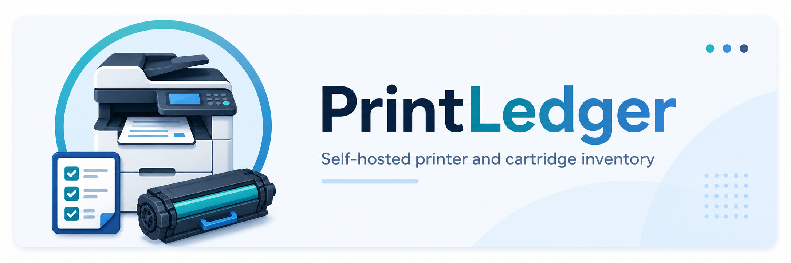
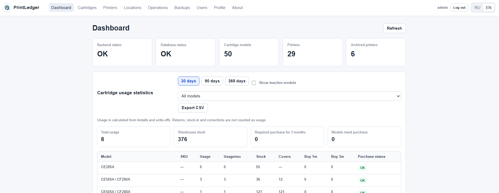
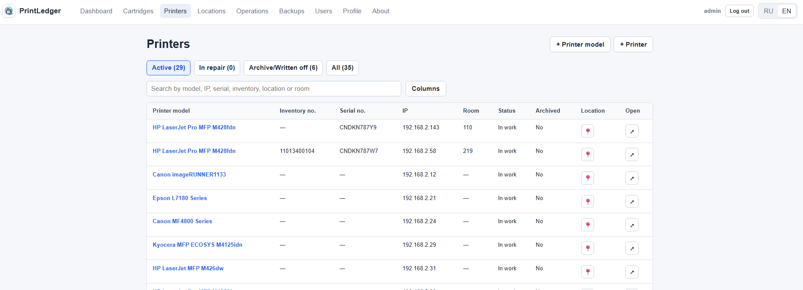
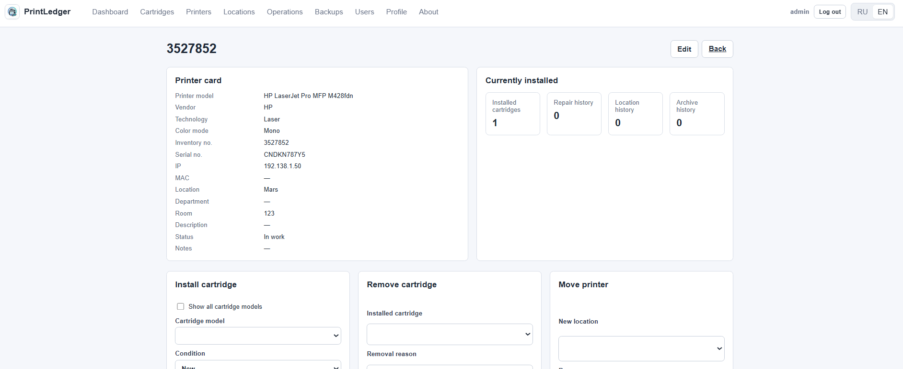
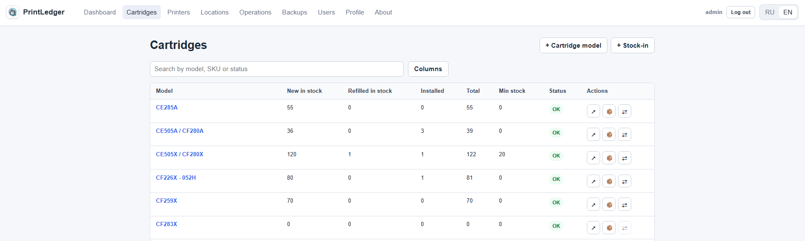
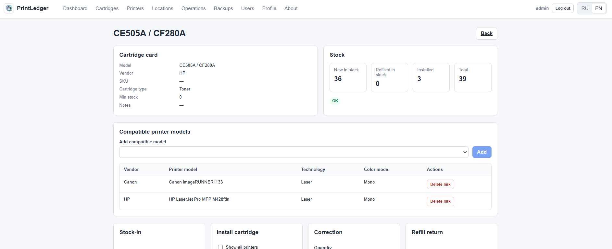
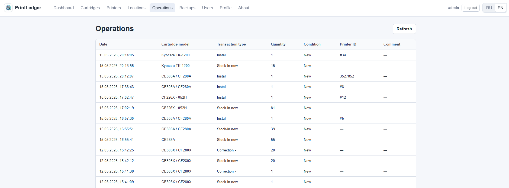
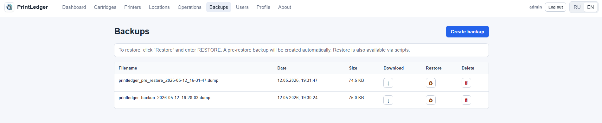

# PrintLedger



**Language / Язык:** [Русский](#русский) · [English](#english)

## Русский

**PrintLedger** — self-hosted open-source система для учета принтеров, картриджей, расходников, складских операций, ремонтов, локаций, пользователей и резервных копий внутри локальной сети.

Проект подходит для небольших IT-команд и организаций, которые хотят заменить Excel-таблицы и ручной учет на структурированное внутреннее web-приложение.

Полезные ссылки:

- Сайт проекта: https://printledger.simplyadmin.org
- Руководство пользователя: [docs/USER_GUIDE_RU.md](docs/USER_GUIDE_RU.md)
- Развертывание: [docs/DEPLOY_RU.md](docs/DEPLOY_RU.md)
- Backup/restore: [docs/BACKUP_RU.md](docs/BACKUP_RU.md)
- Коммерческая поддержка: [COMMERCIAL_SUPPORT.md](COMMERCIAL_SUPPORT.md)

---

## English

PrintLedger is a self-hosted open-source web system for managing printers, cartridges, consumables, stock movements, repairs, locations, and backup operations inside a local network.

It is built for small IT and office teams that need a practical replacement for scattered spreadsheets while keeping data on their own server.

[Website](https://printledger.simplyadmin.org) · [Documentation](#documentation) · [Commercial Support](COMMERCIAL_SUPPORT.md)

## Problem

Printer and cartridge accounting often starts in Excel and becomes hard to maintain:

- cartridge stock is tracked manually and gets out of sync;
- printer locations change without a reliable history;
- refills, write-offs, and replacements are difficult to audit;
- purchase planning is based on memory instead of usage data;
- local network deployments need simple authentication and reliable backups.

PrintLedger keeps the core inventory data in PostgreSQL, records cartridge movements as transactions, and provides a lightweight web UI for daily operations.

## Features

- Printer, cartridge model, organization, branch, and location directories.
- Cartridge-to-printer-model compatibility directory for safer installation choices.
- Cartridge stock movements: stock-in, correction, install, remove, refill return, write-off, and return to stock.
- Stock balance calculation from operation history.
- Printer lifecycle history: movement, repair, archive, and write-off.
- Printer and cartridge cards with related histories.
- Dashboard analytics for cartridge usage and purchase planning.
- CSV export for analytics.
- Local-network authentication with users stored in PostgreSQL.
- Admin-only user management and backup UI.
- PostgreSQL backup, restore, download, and deletion from UI and scripts.
- RU/EN frontend localization.
- Docker Compose development and production deployment with nginx.

## Tech Stack

- Backend: FastAPI, SQLAlchemy 2.0, Alembic
- Frontend: Next.js, TypeScript
- Database: PostgreSQL
- Runtime: Docker Compose
- Reverse proxy: nginx for production

## Screenshots

### Dashboard



### Printers



### Printer card



### Cartridges



### Cartridge card



### Operations



### Backup



Russian UI screenshots are also available in `docs/assets/screenshots_ru/`.

## Quick Start

Clone the repository:

```bash
git clone https://github.com/fedorovdo/printledger.git
cd printledger
```

Create a local environment file:

```bash
cp .env.example .env
```

On Windows PowerShell:

```powershell
Copy-Item .env.example .env
```

Start the development stack:

```bash
docker compose build
docker compose up -d
docker compose exec backend alembic upgrade head
```

Open:

```text
http://localhost:3000
```

Default example credentials are defined in `.env.example`. Change them before using PrintLedger in a real local network.

More details: [docs/INSTALLATION.md](docs/INSTALLATION.md)

## Production Deployment

Production uses a separate Compose file with nginx:

```bash
cp .env.prod.example .env
docker compose -f docker-compose.prod.yml up -d --build
docker compose -f docker-compose.prod.yml exec backend alembic upgrade head
```

Read the Russian deployment guide: [docs/DEPLOY_RU.md](docs/DEPLOY_RU.md)

## Documentation

- [Installation](docs/INSTALLATION.md)
- [Architecture](docs/ARCHITECTURE.md)
- [Authentication](docs/AUTH.md)
- [Frontend overview](docs/FRONTEND.md)
- [API overview](docs/API.md)
- [Backup and restore](docs/BACKUP_RESTORE.md)
- [Smoke tests](docs/SMOKE_TESTS.md)
- [Full archived README](docs/README_FULL.md)
- [Russian user guide](docs/USER_GUIDE_RU.md)
- [Russian deployment guide](docs/DEPLOY_RU.md)
- [Russian backup guide](docs/BACKUP_RU.md)

## Roadmap

See [ROADMAP.md](ROADMAP.md).

## Commercial Support

PrintLedger is open-source. Paid installation, deployment, customization, reporting, migration, and support services are available.

See [COMMERCIAL_SUPPORT.md](COMMERCIAL_SUPPORT.md).

## License

MIT License. See [LICENSE](LICENSE).
